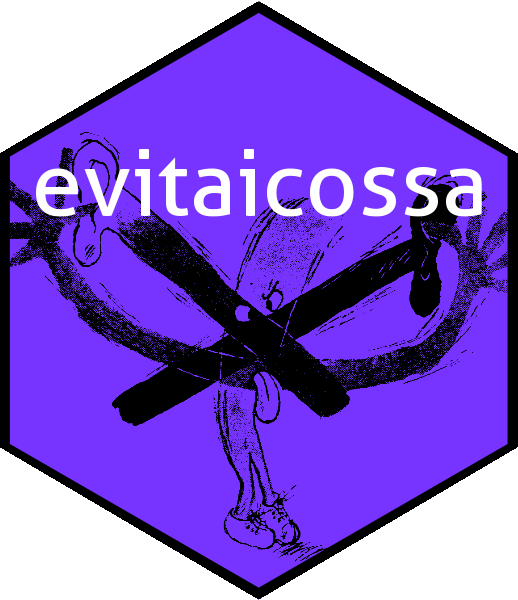

Antiassociative algebra in R: introducing the `evitaicossa` package
================

<!-- README.md is generated from README.Rmd. Please edit that file -->

# 

An *algebra* is a vector space equipped with a bilinear product: the
vectors may be multiplied. Algebras may be defined over any field but
here we use the real numbers. An *antiassociative* algebra is an algebra
in which the usual associativity relation
=(\mathbf{u} \mathbf{v})\mathbf{w}")
for vector multiplication is replaced by =-(\mathbf{u} \mathbf{v})\mathbf{w}"). Antiassociative
algebras are nilpotent of nilindex 4: the product of any four vectors is
zero. Antiassociative algebras are the direct sum of elements of degree
1,2 and 3 (the antiassociativity condition implies that the degree zero
component is trivial, and the nilpotence ensures that components of
degree four or above do not exist). Thus the general form of an element
of an antiassociative algebra is thus
\mathbf{x}_k") where
,
,

are constants and the

are indeterminates.

The `evitaicossa` package provides some R-centric functionality for
working with antiassociative algebras. In an R session, you can install
the released version of the package from
[CRAN](https://CRAN.R-project.org) with:

``` r
# install.packages("evitaicossa")  # uncomment to install the package
library("evitaicossa")             # loads the package 
```

The package includes a single S4 class `aaa` \[for
“**a**nti**a**ssociative **a**lgebra”\] and a range of functions to
create objects of this class. A good place to start is function
`raaa()`, which creates a random object of class `aaa`:

``` r
(evita <- raaa())
#> free antiassociative algebra element:
#> +5a +2d +2a.b +1b.d +3c.c +1(a.d)c +3(b.b)c +2(c.a)c
```

``` r
(icossa <- raaa())
#> free antiassociative algebra element:
#> +7c +2d +3a.d +4c.a +3d.a +3(a.b)b +2(c.a)a +2(d.a)b
```

``` r
(itna <- raaa())
#> free antiassociative algebra element:
#> +3b +2c +2a.d +1d.b +2d.d +1(b.b)a +4(b.d)d +3(c.c)a
```

Above, we see objects `evita`, `icossa` and `itna` are random
antiassociative algebra elements, with indeterminates `a`, `b`, `c`,
`d`. These objects may be combined with standard arithmetic operations:

``` r
evita+icossa
#> free antiassociative algebra element:
#> +5a +7c +4d +2a.b +3a.d +1b.d +4c.a +3c.c +3d.a +3(a.b)b +1(a.d)c +3(b.b)c
#> +2(c.a)a +2(c.a)c +2(d.a)b
```

``` r
evita*icossa
#> free antiassociative algebra element:
#> +35a.c +10a.d +14d.c +4d.d -15(a.a)d +14(a.b)c +4(a.b)d -20(a.c)a -15(a.d)a
#> +7(b.d)c +2(b.d)d +21(c.c)c +6(c.c)d -6(d.a)d -8(d.c)a -6(d.d)a
```

It is possible to verify some of the axioms as follows:

``` r
c(
left_distributive  = evita*(icossa + itna) == evita*icossa + evita*itna,
right_distributive = (evita + icossa)*itna == evita*itna + icossa*itna,
antiassociative    = evita*(icossa*itna)   == -(evita*icossa)*itna
)
#>  left_distributive right_distributive    antiassociative 
#>               TRUE               TRUE               TRUE
```

For further details, see the package vignette

`vignette("evitaicossa")`
